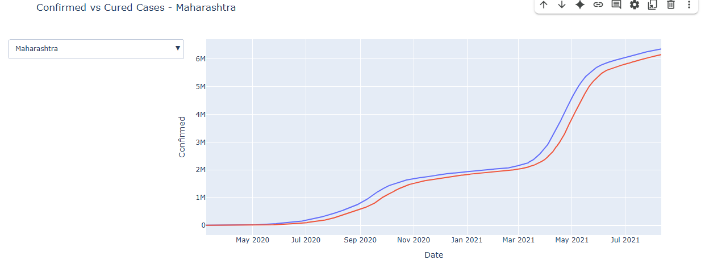

## COVID-19 India Dashboard and Forecasting

📌 Interactive dashboard to analyze COVID-19 impact across Indian states and forecast future case trends.

### Features
- 📊 Bar charts: Confirmed, Cured, Deaths by State
- 📈 Time series with dropdown (state-wise)
- 🔮 Forecasting using Prophet (30-day trend)
- 📎 Built using Plotly, Prophet, Pandas, Python

### How to Run
1. Install dependencies: `pip install - requirements.txt`
2. Run `india_covid_19.py`.
3. Choose your state and view visual insights + forecasts

### Example Forecast (Maharashtra)

### Author
- Vara Prasad
